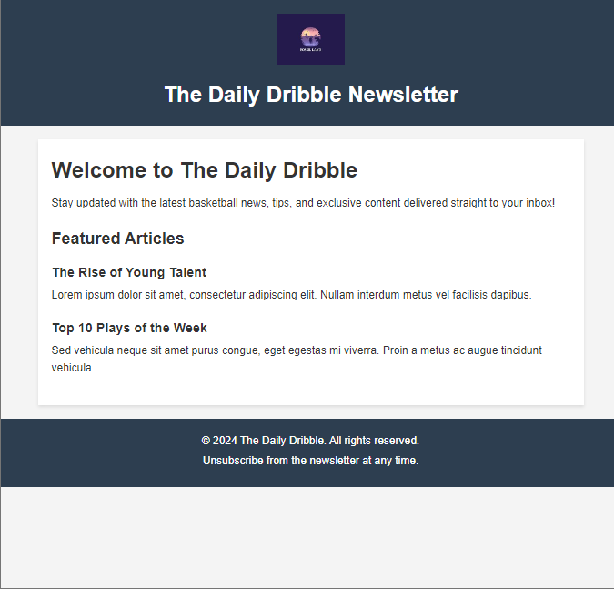

# The Daily Dribble Newsletter

This is a simple newsletter website that keeps readers updated with the latest basketball news, tips, and exclusive content. The page includes a welcoming introduction, featured articles, and a footer with unsubscribe information. The website is styled using CSS for a clean and engaging layout.

## Table of Contents
- [Live Demo](#live-demo)
- [Screenshot](#screenshot)
- [Features](#features)
- [Technologies Used](#technologies-used)

## Live Demo
Check out the live demo of this project: [The Daily Dribble Newsletter](https://scrimba-horatio-daily-dribble-project.netlify.app/)

## Screenshot

## Features
- Engaging layout with an introductory section and featured articles.
- Simple and responsive design for various screen sizes.
- Easy-to-read typography and styling.

## Technologies Used
- **HTML5** for markup.
- **CSS3** for styling, ensuring a visually appealing design.
- **Netlify** for hosting the live demo (or another platform of your choice).
